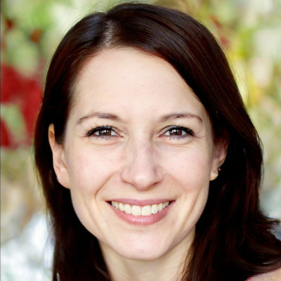

# Bountiful Foods Site Plan

**Kylar Sorensen**

## Site Name and Domain

**Site Name :** Bountiful Foods
**Site Domain :** bountiful-foods-ca.com
The domain has been checked through Google Domains and verified that it is available for $12 per year.

---

## Site Purpose

The purpose of the Bountiful Foods website is primarly to attract and educate customers in order to increase overall revenue for the company. The site will provide information on what Bountiful Foods offers, and where they can be found, including where to find their many food trucks scattered throughout the coastal area from Los Angeles to San Diego. The site will also include basic contact information for the company. The site will generate revenue for the company through allowing customers to place orders online through the site. Furthermore, the site will have the potential to run ads, further boosting revenue.

As for education, the site will provide information on the local farms from where the fruits are sourced. The site will also provide a platform to make clear the mission of the company, which is to provide fresh and healthy food options to the local population and visiting tourists. Finally, the website will be a form of advertisement of the company to other potential suppliers.

---

## Target Audience

The target audience for this website includes people of all ages who are looking for tasty and healthy foods and beverages. Those who are interested in placeing their orders online, as opposed to ordering in person, make up the main target audience. However, others included in the target audience include potential suppliers and those who want to learn more about the company and the sources and suppliers the company uses.

The majority of the people that use the site will most likely be from the coastal area of California, as the company is based in San Diego. However, the site will also be used by tourists who are visiting the area and are looking for a healthy and tasty snack or meal. The average user will mostly likely be young adults, as they are the ones who are most likely to be interested in ordering online and taking advantage of the technology available. However, the site will also be used others who are health concious, so long as they are comfortable using the internet.
 

### Personas:

#### Persona 1

**Photo:**

<table>
  <tr>
    <th>Fictional Name</th>
    <td>Kevin Matthew</td>
  </tr>
    <th>Job Title</th>
    <td>Student</td>
  <tr>
    <th>Age</th>
    <td>24</td>
  </tr>
  <tr>
    <th>Location</th>
    <td>San Diego, CA</td>
  </tr>
  <tr>
    <th>Education</th>
    <td>Bachelor's Degree</td>
  </tr>
  <tr>
    <th>Income</th>
    <td>$50,000</td>
  </tr>
  <tr>
    <th>Family Status</th>
    <td>Married, no kids</td>
  </tr>
  <tr>
    <th>Technology</th>
    <td>iPhone 11 Pro Max, MacBook Pro 16", iPad Pro 12.9"</td>
  </tr>
  <tr>
    <th>Attitudes and Behaviors</th>
    <td>Kevin is a student who is looking for a healthy and tasty lunch option. He is looking for a place that is close to his school, and that has a variety of options. He is also looking for a place that is affordable, and that he can order online.</td>
</table>

  

#### Persona 2

**Photo:**

<table>
  <tr>
    <th>Fictional Name</th>
    <td>Linda Thomas</td>
  </tr>
    <th>Job Title</th>
    <td>Pediatrician</td>
  <tr>
    <th>Age</th>
    <td>43</td>
  </tr>
  <tr>
    <th>Location</th>
    <td>Carlsbad, CA</td>
  </tr>
  <tr>
    <th>Education</th>
    <td>M.D.</td>
  </tr>
  <tr>
    <th>Income</th>
    <td>$150,000</td>
  </tr>
  <tr>
    <th>Family Status</th>
    <td>Married, 3 kids</td>
  </tr>
  <tr>
    <th>Technology</th>
    <td>iPhone 13 Pro, iPad Pro 12.9"</td>
  </tr>
  <tr>
    <th>Attitudes and Behaviors</th>
    <td>Linda is a doctor and a mom. She is always looking for healthy options for food and snacks for both herself and her kids. She prefers ordering food online and picking it up since she is always busy. Since she has three kids, she tends to look for options that are affordable. She likes shopping locally. </td>
</table>

---

## Site Map

---

## Color Scheme

**Source:** https://coolors.co/f68b15-d90102-46580c-f36165-d7e841

**Main Color:** #F68B15
**Secondary Color:** #D90102
**Accent 1 Color:** #46580C
**Accent 2 Color:** #F36165
**Accent 3 Color:** #D7E841

The main color will be used for the background of the site, and for the main buttons. The secondary color will be used for the background of the headings and subheadings. The accent colors will be used for the background of other elements and buttons.

---

## Typography

**Font:** Rubik - Medium 500
**Font:** Poppins - Regular 400
**Source:** https://fonts.google.com/share?selection.family=Poppins%7CRubik:wght@500

Rubik will be used for the headings and subheadings, while Poppins will be used for the body text. Backup fonts for Rubik will be Arial and Sans Serif, while backup fonts for Poppins will be Helvetica and Sans Serif. Both will be black when on white backgrounds and white on most colored backgrounds. Font size for the body text in small views will be 16px, in medium views it will be 18px, and in large views it will be 20px.

<h3 style="font-family:Rubik">An example of an h3 heading with Rubik weight 500 font</h3>

An example of a paragraph with Poppins weight 400 font

---

## Wireframe Sketches

